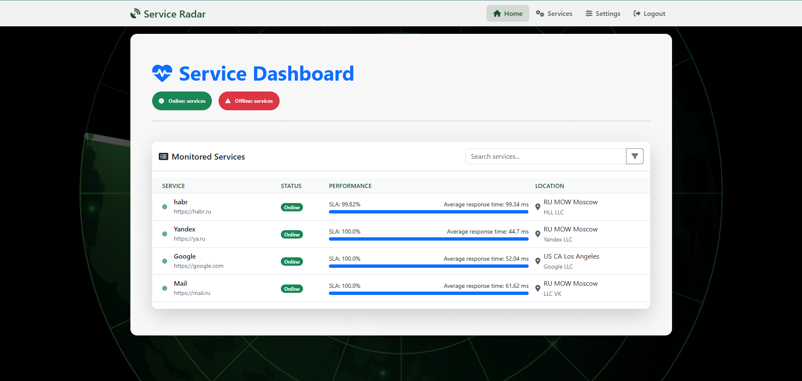
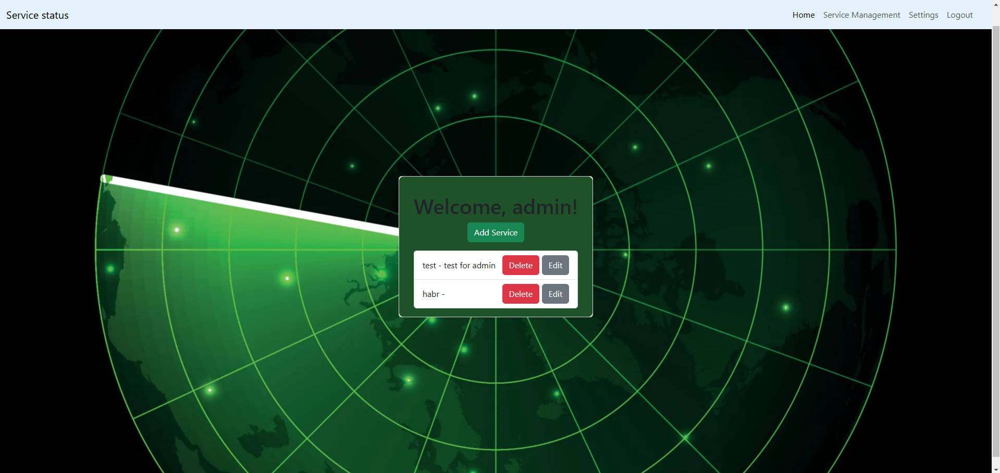

# Service Locator 🖥️🔍

A project for monitoring the availability of services with a web interface, notifications, and SLA analytics.

---

## Main functions
- **Monitoring of HTTP/TCP services**  
  Checking availability through requests or checking ports.
- **Geolocation of services**  
  Definition of the country, region, city and provider by IP.
- **SLA reports**  
  Calculating response time and availability as a percentage.
- **Multi-user system**  
  Registration, authentication, and data isolation between users.
- **Email notifications**  
  Alerts when the service status changes (online/offline).

---

## Installation
1. **Clone a repository**:
   ```bash
   git clone https://github.com/BTemplar/Service_Locator.git
   cd Service_Locator
2. **Installing Libraries**:
   ```bash
   pip install -r requirements.txt
3. **Initialize the database (automatically generated at the first startup)**:
   ```bash
   flask shell
   from database import init_db
   init_db()
   exit()
4. **Configure the configuration**:  
   Create a conf/config.ini file (automatically generated at the first start) and specify:
   ```ini
   [SMTP]
   e-mail = your-email@example.com
   password = your-password
   server = smtp.example.com
   port = 587

   [Schedule]
   interval = 300  
## Launch  
```bash  
flask run --host=0.0.0.0  
```
The application will be available at: http://localhost:5000.
## Using  
1. Registration: Create an account by going to the registration form __`Register here`__ on the main page.
2. Adding services:

    * Maximum of 10 services per user.
    * Supported formats: `http://example.com`, `example.com:8080`.

3. Monitoring:

    * The statuses are updated every 5 minutes (configured in `config.ini').
    * Detailed statistics are available on the main page.

4. Notifications:

    * When the service status changes, an email is sent.
## Технологии  
* **Backend**: Flask, SQLAlchemy, APScheduler
* **Frontend**: Bootstrap 5, Jinja2
* **Additionally**: SMTP, IP geolocation (via an external `API')
## License
MIT License. More details in the file [LICENSE](LICENSE).

---

Author: Oleg Rud  
GitHub: [@BTemplar](https://github.com/BTemplar)  
Email: [templar@internet.ru](mailto:templar@cyberswarm.ru)  

---

### Screenshots:

## Interface
| Main page | Service management |
|------------------|-----------------------|
|  |  |